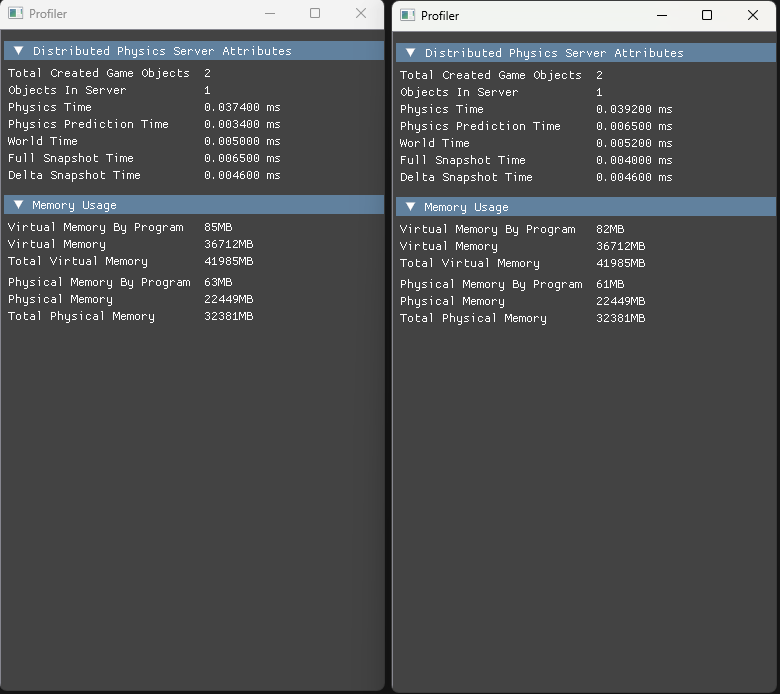

# Architecture

The four roles of the distributed physics system and how they coordinate from startup to a running simulation. For building see [SETUP.md](SETUP.md); for ports and running see [DEPLOY.md](DEPLOY.md).

## The four roles

| Role | Responsibility | Key class(es) | Entry file |
|---|---|---|---|
| **Distributed Manager** | Central orchestrator. Tracks midwares and clients, creates game instances, computes per-server region borders, tells midwares to spawn servers, and tells clients where to connect. | `SystemManager` | `DistributedPhysicsManager/SystemManager.cpp`, `ProgramStart.cpp` (`StartProgram`) |
| **Physics Server Midware** | Per-machine process launcher. Connects to the manager and, on command, spawns a Game Server process via `CreateProcessA`. | `ServerMidwareManager` | `PhysicsServerMidware/ServerMidwareManager.cpp`, `ProgramStart.cpp` (`StartMidware`) |
| **Distributed Game Server** | Simulates physics for the objects inside its assigned region. Hands objects off to neighbours at borders, and broadcasts world snapshots to clients. | `DistributedGameServerManager` + `ServerWorldManager` | `DistributedGameServer/ServerStarter.cpp` (`StartGameServer`) |
| **Game Client** | Connects to the manager, is routed to a physics server, and renders the replicated world. | `DistributedMultiplayerGameScene` | `CSC8503/DistributedMultiplayerGameScene.cpp` |

The manager and the game server each run **two** network endpoints:

- The **Manager** runs `DistributedPhysicsManagerServer` (its listen server on 1234).
- The **Game Server** runs `DistributedPhysicsServerClient` (its *uplink* to the manager) **and** `DistributedPacketSenderServer` (its *downlink* that clients subscribe to). It also opens `GameClient` connections to peer game servers for object handoff.

See [NETWORKING.md](NETWORKING.md) for the connection roles and packet flow.

## End-to-end bootstrap sequence

The system assembles itself in phases. Each step is driven by a packet (catalogue in [NETWORKING.md](NETWORKING.md)).

1. **Midware connects.** Each midware connects to the manager on 1234 and sends `PhysicsServerMiddlewareConnected` (`ServerMidwareManager::SendMidwareConnectedPacket`). The manager assigns a midware ID and replies with `PhysicsServerMiddlewareData`.
2. **Instance creation.** The operator presses **`S`** on the manager (`DistributedPhysicsManager/ProgramStart.cpp:79`). `SystemManager::CreateNewGameInstance` builds a `GameInstance`, which computes each server's `GameBorder` and encodes them as strings (see [SPATIAL-PARTITIONING.md](SPATIAL-PARTITIONING.md)).
3. **Client connects.** A client sends `DistributedClientConnectedToManager`; the manager adds the player to the instance and replies with `DistributedClientGetGameInstanceData` (instance ID, player number, counts).
4. **Server spawn.** When the instance is startable, `SystemManager::StartGameServers` sends a `RunDistributedPhysicsServerInstance` packet (with the border string) to the chosen midware, which spawns `./DistributedPhysicsServer/EntryPoint.exe` with the [launch string](DEPLOY.md#the-game-server-launch-string).
5. **Server registration.** The Game Server starts, parses its args, connects its `DistributedPhysicsServerClient` to the manager, and — on connect — opens its `DistributedPacketSenderServer` on port `(peerID*10)+1000` (`DistributedGameServerManager.cpp:62-64`). It reports back with `DistributedPhysicsClientConnectedToManager`. The manager then broadcasts `DistributedClientConnectToPhysicsServer` to clients so they connect to that packet-sender port.
6. **Server-to-server mesh.** Each Game Server receives `StartDistributedPhysicsServer` (carrying every server's IP/port/border), then opens `GameClient` connections to the *other* servers so objects can be handed off at borders.
7. **Game start.** Once all servers report their clients connected (`DistributedPhysicsServerAllClientsAreConnected`) and the instance is ready, the manager broadcasts `GameStartState`. Servers create the player objects and begin ticking physics; clients flip to the in-game state.

## Per-process update model

Each role is a single-threaded main loop over a window/timer; networking is polled (non-blocking ENet) each frame.

- **Manager** — `systemManager->GetServer()->UpdateServer()` each frame (`ProgramStart.cpp`).
- **Midware** — `midwareManager->Update(dt)` polls its manager client (`PhysicsServerMidware/ProgramStart.cpp`). The actual process spawn happens on a detached thread (`ServerMidwareManager.cpp:92-96`).
- **Game Server** — `ServerStarter.cpp:110-133` runs the loop: it polls the network via `UpdateGameServerManager(dt)` and, when the game has started, ticks physics via `serverManager->GetServerWorldManager()->Update(dt)`. Frames with `dt > 0.1s` are skipped to avoid a huge step after a stall (`ServerStarter.cpp:113`).

### Snapshot timing

Inside `DistributedGameServerManager::UpdateGameServerManager` (`:100-124`), once the game is running the server first processes object transitions, then advances a packet timer. Every tick it sends a snapshot: one **full** state every 6th send and **delta** states in between (`mPacketsToSnapshot = 5`), with the timer advanced by `1.0f/60.f` per send (the code annotates this as the "20hz server/client update" cadence). Details and packet layouts are in [NETWORKING.md](NETWORKING.md).

> Note: a dedicated sender thread (`SendPacketsThread`) exists but is currently **commented out** (`DistributedGameServerManager.cpp:69-70`); snapshots are broadcast inline in the main update loop.

## Illustrative profiling

The dissertation captured a two-server run. The profiler windows for the manager, game client, and the per-server snapshot timings:

(See also `DissertationEvaluationVisuals/TwoServer/distManager.png` and `gameclient.png`.)

## Next

- [NETWORKING.md](NETWORKING.md) — the packets named above, in detail.
- [SPATIAL-PARTITIONING.md](SPATIAL-PARTITIONING.md) — how regions and object handoff work.
